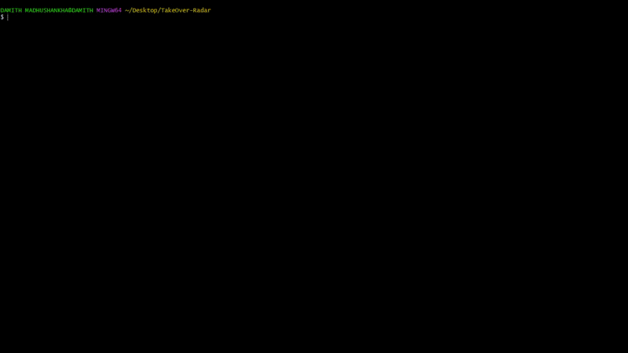

# ⚡ TakeOver-Radar v1.5

<p align="center">
  
  
  
</p>

A blazing-fast, multi-threaded **Subdomain Takeover Scanner** written in Python. It features a modern, clean, and beautiful terminal user interface powered by the `rich` library. Designed specifically for Bug Bounty Hunters, Pentesters, and Security Researchers to find vulnerable subdomains before anyone else.

Developed with ❤️ by **Damith Madhusankha**.

---

## ✨ Features

* **🏎️ Blazing Fast Multi-threading:** Scan hundreds of subdomains simultaneously using managed worker threads.
* **🔍 Smart DNS Verification:** Double-checks `CNAME` records to filter out dead domains first, saving time and web requests.
* **🎯 25+ Pre-loaded Fingerprints:** Equipped with signatures for popular services like GitHub Pages, Heroku, Vercel, AWS S3, Shopify, Zendesk, and more.
* **📊 Beautiful Terminal UI:** Color-coded status tables and live progress bars so you can spot vulnerabilities instantly.
* **💾 Auto-Saving Results:** Automatically outputs all detected vulnerable domains into a clean text file (`vulnerable_results.txt`).

---

## 📸 Screen Preview

When you run the tool, it generates a beautiful, professional, and easy-to-read summary report just like this:

<p align="center">
  
</p>

---

## 🚀 Installation & Setup

### 1. Clone the Repository
```bash
git clone https://github.com/damithmadhusankha-online/TakeOver-Radar
cd TakeOver-Radar
```

### 2. Install Dependencies
Make sure you have Python installed, then run:
```bash
pip install -r requirements.txt
```
## 🕹️ Usage
Prepare your target subdomains in a text file (e.g., targets.txt) and run the scanner:
```bash
python takeover.py -f targets.txt -t 30
```
## ⚙️ Command-Line Options
 *  -f, --file : (Required) Path to the text file containing the subdomains list.

 *  -t, --threads : (Optional) Number of concurrent threads to use (Default: 25).

 *  -o, --output : (Optional) Custom path to save vulnerable results (Default: vulnerable_results.txt).

## ☕ Support My Work

If this tool helped you catch a bounty, saved your configuration time, or if you just love open-source cybersecurity tools, consider supporting my work!

### Option 1: Support via Ko-fi (Card / PayPal)

[](https://ko-fi.com/damithmadhusankha)
### Option 2: Support via Crypto (Bybit Wallet)
You can also send donations directly to my **Bybit** wallet using the following addresses:

* **USDT (TRC-20):** `TKCp2nJBAnWZ9nrbd2gVSxr9vfm4zKzBSB`
* **Bitcoin (BTC):** `1GsitRujVAZcBuJzUjrYyv99JGMdK6Ybhw`
* **Ethereum (ETH / ERC-20):** `0xf4f280b652ca4f61b1471f7b7fadf94123baa511`

## 🛡️ Disclaimer

This tool is developed for educational purposes and authorized penetration testing only. Modifying, scanning, or interacting with targets without prior mutual consent is illegal. The developer assumes no liability and is not responsible for any misuse or damage caused by this program.
